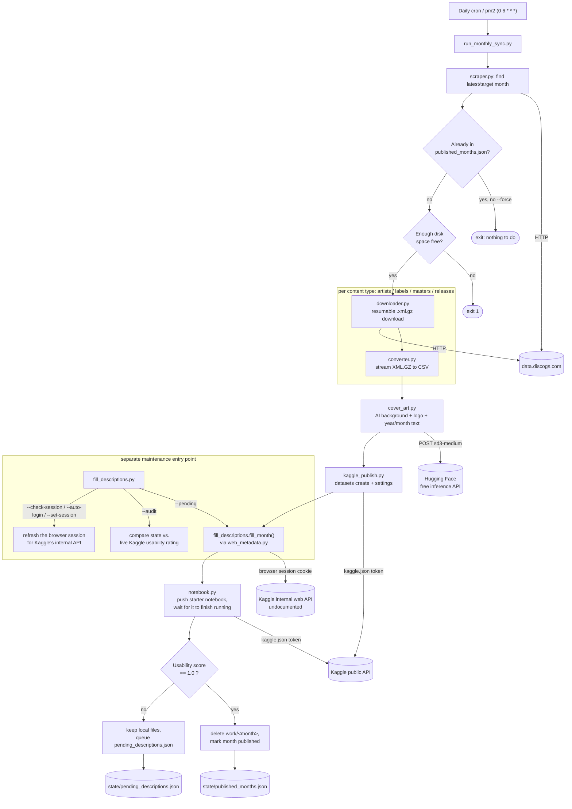

# Discogs Kaggle Sync

Automates what [ofurkancoban](https://github.com/ofurkancoban) was previously doing by
hand each month: download the latest [Discogs data dump](https://data.discogs.com/),
convert it from XML.GZ to CSV, and publish it as a new Kaggle dataset (e.g.
[Discogs Data Dumps (April 2025)](https://www.kaggle.com/datasets/ofurkancoban/discogs-data-dumps-april-2025)).

## How it works

1. **Check for a new month** - scrapes `data.discogs.com` for the most recent month with
   `artists`/`labels`/`masters`/`releases` dumps.
2. **Skip if already published** - `state/published_months.json` tracks what's already on
   Kaggle, so re-running (or an overlapping cron run) is always safe. A disk-space check
   also fails fast here if there isn't enough room for the month about to be processed.
3. **Download** each of the 4 files with resume-on-reconnect (`discogs_kaggle_sync/downloader.py`).
4. **Convert** each `.xml.gz` straight to CSV (`discogs_kaggle_sync/converter.py`) - the
   two-pass column-discovery-then-write approach from the DiscogsGUI project, but chunking
   reads directly off the gzip stream instead of a fully-decompressed `.xml` file, since the
   `releases` dump alone is ~10GB compressed and tens of GB unpacked. The compressed file is
   deleted the moment its CSV exists, so peak disk usage stays as low as this format allows.
5. **Generate a cover image** (`discogs_kaggle_sync/cover_art.py`) - a fresh AI-generated
   record-shop background photo (via Hugging Face's free inference API, a different random
   seed every month) with the "Discogs" logo and the year/month composited on top; falls
   back to a static base image if AI generation isn't available for any reason.
6. **Publish to Kaggle** as a new dataset (`discogs_kaggle_sync/kaggle_publish.py`) - one
   dataset per month, matching the existing manually-published naming pattern. Column
   descriptions come from `discogs_kaggle_sync/column_descriptions/*.json`, written once per
   content type and reused every month (Discogs' XML schema barely changes month to month).
   Any column not in that file gets a generic placeholder description and a warning in the
   log, so schema drift is visible instead of silently under-documented.
7. **Fill in what Kaggle's public API silently drops** (`discogs_kaggle_sync/web_metadata.py`,
   driven by `fill_descriptions.py`) - file/column descriptions and the Provenance section
   (Sources + Collection Methodology) all go through an undocumented endpoint that only
   accepts a browser session, not the `kaggle.json` API token. See
   [Web session for metadata](#web-session-for-metadata) below.
8. **Publish a companion starter notebook** (`discogs_kaggle_sync/notebook.py`) and wait
   for it to actually finish running on Kaggle - a `kernels push` only queues the run, and
   Kaggle's "Publish a notebook" checklist item only clears once it completes successfully.
   This step runs last and its failure doesn't block anything above: the final usability
   score is re-read afterward, and local files are only cleaned up once that score is a
   perfect 1.0 - otherwise they're left in place for a retry.



## Requirements

- **Disk**: at least ~100GB free scratch space. `releases.xml.gz` is ~10GB compressed and
  unpacks to tens of GB; even with the streaming approach above, the chunked intermediate
  files plus the final CSVs need real headroom.
- **A machine that can run unattended for hours**: a VPS with cron, not GitHub Actions -
  GitHub-hosted runners only have ~14GB of free disk, nowhere near enough for `releases`.
- A [Kaggle API token](https://www.kaggle.com/settings) at `~/.kaggle/kaggle.json`.
- A Kaggle account's email/username and password in `.env`, for the web-session login that
  fills in what the API token can't (see below).

## Setup

```bash
python3 -m venv .venv
source .venv/bin/activate
pip install -r requirements.txt

# Kaggle API credentials (from https://www.kaggle.com/settings -> Create New Token)
mkdir -p ~/.kaggle
mv ~/Downloads/kaggle.json ~/.kaggle/kaggle.json
chmod 600 ~/.kaggle/kaggle.json

# Web-session credentials, for the metadata Kaggle's API token can't reach (see below)
cp .env.example .env
# then edit .env and fill in KAGGLE_USER / KAGGLE_PASSWORD
```

## Running

```bash
python run_monthly_sync.py --kaggle-owner YOUR_KAGGLE_USERNAME
```

Useful flags:

- `--work-dir PATH` - scratch directory for downloads/conversion (default `./work`).
- `--force` - re-process even if this month is already marked published. Useful if Discogs
  re-uploads a corrected dump.
- `--month YYYY-MM` - target a specific month instead of the latest one on
  `data.discogs.com`.
- `--replace-existing` - delete the month's existing Kaggle dataset before republishing.
  Only for deliberately iterating on one month; permanently drops that dataset's
  view/download/vote history. Never combine with an unattended cron run.
- `--keep-staging` - don't delete the staged CSVs/cover image after a successful publish.
  Combine with `--force` on a later run to re-publish in seconds instead of redoing hours
  of conversion, while iterating on metadata/cover art/settings.
- `--only-types artists,labels,...` - debug only: process a subset of the 4 content types.
  Publishes a real (but incomplete) dataset and never marks the month as published, since
  it's missing files - for exercising the publish pipeline cheaply, never for a real month.
- `--update-metadata-only` - skip downloading/converting; just regenerate metadata (file
  info, column descriptors) and update settings/notebook for the target month.

## Scheduling

Runs **daily**, not on a fixed day of the month - `state/published_months.json` makes a
run a no-op (exits in seconds) once the current month is already published, so a daily
check costs almost nothing and catches whatever day Discogs actually publishes on, instead
of guessing a fixed date and possibly missing it by a day or two.

Two ways to schedule it, pick one:

- **crontab** - see [`crontab.example`](crontab.example), installed via `crontab -e`.
- **pm2** - see [`ecosystem.config.js`](ecosystem.config.js) if the VPS already uses pm2
  for other processes (`pm2 start ecosystem.config.js`); gives you `pm2 logs`/`pm2 status`
  for this job alongside everything else instead of a separate crontab entry.

## Column descriptions

`discogs_kaggle_sync/column_descriptions/{artists,labels,masters,releases}.json` map a CSV
column name to its Kaggle-facing description. These were written once against a real
generated schema and should only need updates if Discogs changes its XML structure - the
sync script's log output will flag any column it doesn't recognize (`... column(s) have no
description on file`) so you know when that's happened.

## Web session for metadata

Kaggle's documented dataset API accepts a file description and a column schema, returns
success, and then silently drops both (open since 2020 as
[kaggle-api#248](https://github.com/Kaggle/kaggle-api/issues/248)). The Provenance section
(Sources / Collection Methodology) has the same problem, plus a field -
`Collection Methodology` - that the documented API has no way to set at all. Kaggle's own
web UI writes all of this through a different, undocumented service
(`datasets.databundles.DatabundleService` / `datasets.DatasetService`) that also happens to
be what actually triggers Kaggle's usability-rating recompute, which is why the "Pending
Actions" checklist on a dataset's page can stay stuck even when the documented API call
"succeeded". `discogs_kaggle_sync/web_metadata.py` drives that same service directly; it's
undocumented and can change without notice, unlike everything else in this project.

This only works with a **browser session** (a cookie + XSRF token), not the API token in
`kaggle.json`. Three ways to get/refresh one:

1. **Automatic (recommended)** - set `KAGGLE_USER` (or `KAGGLE_EMAIL`) and
   `KAGGLE_PASSWORD` in `.env`. `run_monthly_sync.py` calls this automatically whenever the
   saved session has lapsed; no manual step needed in normal operation.
   ```bash
   python fill_descriptions.py --auto-login
   ```
2. **Check whether the current session still works**, and how long it has left:
   ```bash
   python fill_descriptions.py --kaggle-owner YOUR_KAGGLE_USERNAME --check-session
   ```
3. **Manual, if automatic login ever stops working** - open a logged-in kaggle.com tab,
   DevTools → Network, find any request to `kaggle.com/api/i/...`, right-click → Copy →
   Copy as cURL, then:
   ```bash
   python fill_descriptions.py --set-session
   # paste the cURL command, then Ctrl-D
   ```

If a run's session has lapsed when it tries to fill descriptions, that month is queued in
`state/pending_descriptions.json` instead of failing the whole sync. Catch up on the queue
once a session is available again:

```bash
python fill_descriptions.py --kaggle-owner YOUR_KAGGLE_USERNAME --pending
```

This is safe to run from cron alongside the main sync - a lapsed session just logs a
warning and leaves the queue for the next attempt.
